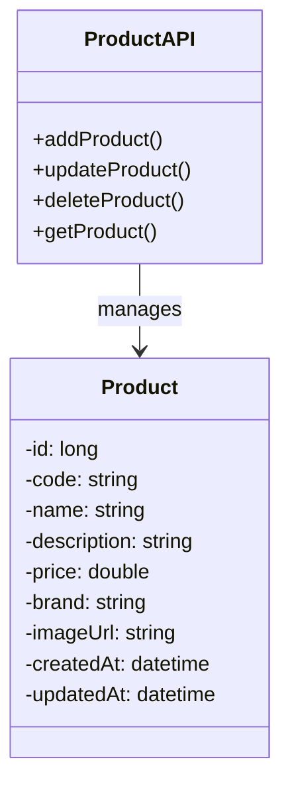
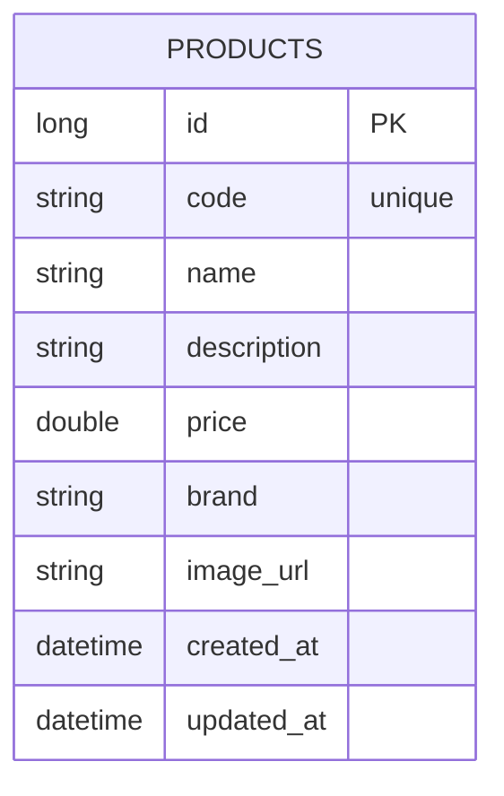

# Product-API

UML:

```mermaid
classDiagram
    class ProductAPI {
      +addProduct()
      +updateProduct()
      +deleteProduct()
      +getProduct()
    }
    
    class Product {
      -id: long
      -code: string
      -name: string
      -description: string
      -price: double
      -brand: string
      -imageUrl: string
      -createdAt: datetime
      -updatedAt: datetime
    }
    
    ProductAPI --> Product : manages
```

ERD

```mermaid
erDiagram
    PRODUCTS {
        long id "PK"
        string code "unique"
        string name
        string description
        double price
        string brand
        string image_url
        datetime created_at
        datetime updated_at
    }

```
